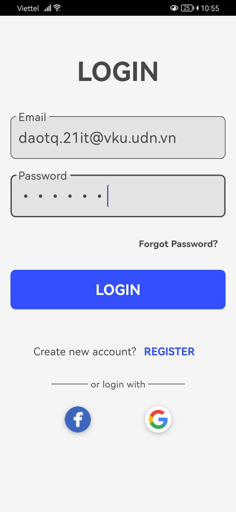
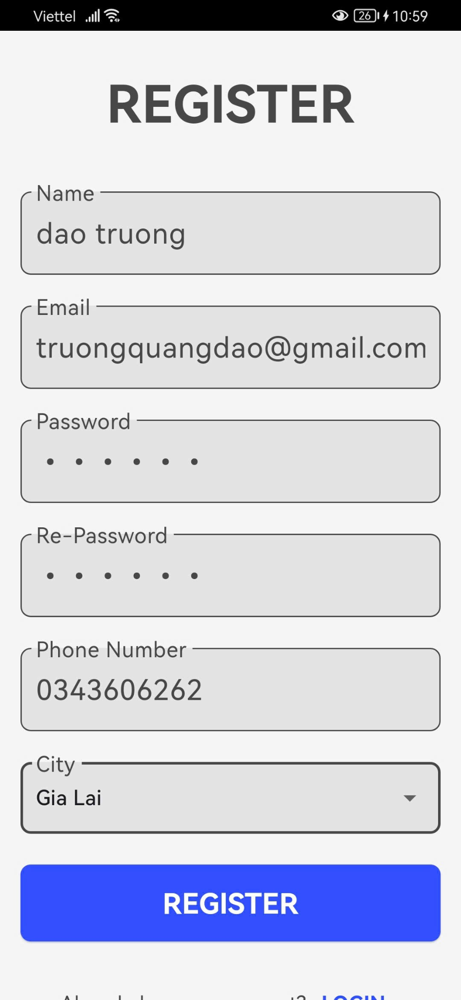
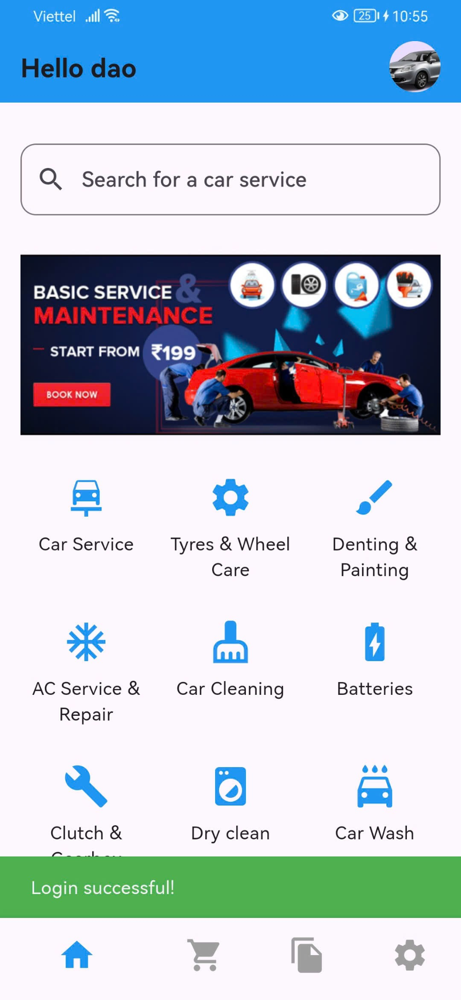
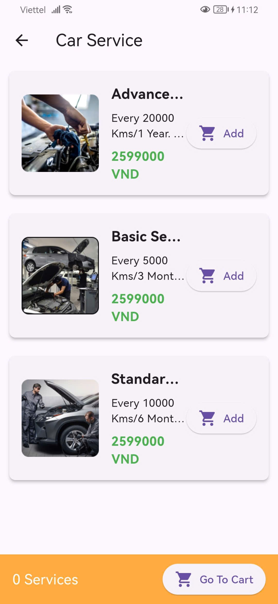
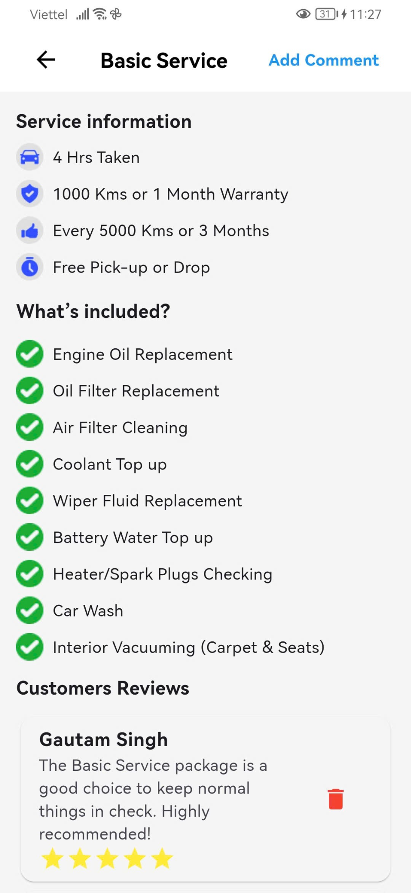
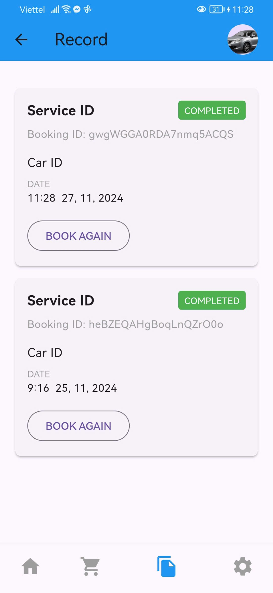
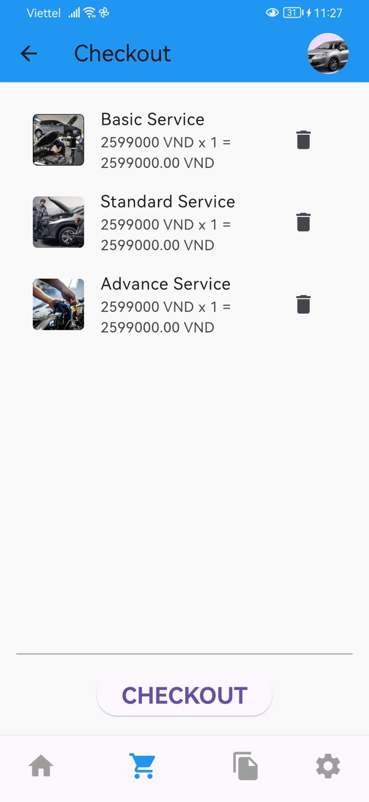
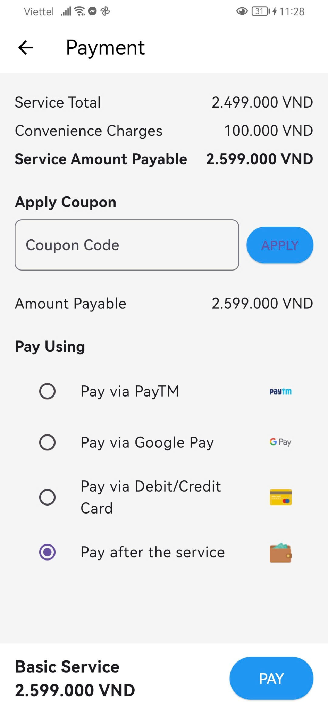

# Car Servicing
Car maintenance management application

## Introduction
Car Servicing is a mobile application that helps you track vehicle maintenance schedules, store service history, and schedule maintenance appointments easily. The app is designed to ensure your vehicle remains in optimal condition.

## Features
- Manage vehicle information and maintenance history.
- Schedule service appointments.
- Track service status.
- Add and display images related to vehicle maintenance.
## Installation
### Requirements
- Flutter and Dart installed.
- Android Studio or VS Code with the Flutter extension.
### Setup Instructions
1. Clone the repository:
    ``` bash
    git clone https://github.com/vietthuan03/car-servicing.git  
    ```
2. Navigate to the project folder:
   ``` bash
   cd car-servicing
   ```
3. Install dependencies:
   ``` bash
   flutter pub get
   ```
4. Run the application:
   ``` bash
   flutter run
   ```
## Application interface
| Login | Sign In | Home | Service |
|-------|--------|------|---------|
|  |  |  |  |

| Detail Service | History | Checkout | Payment |
|---------------|---------|----------|---------|
|  |  |  |  |


## Contributing

Pull requests are welcome. For major changes, please open an issue first
to discuss what you would like to change.

Please make sure to update tests as appropriate.

## License

[MIT](https://choosealicense.com/licenses/mit/)
    
